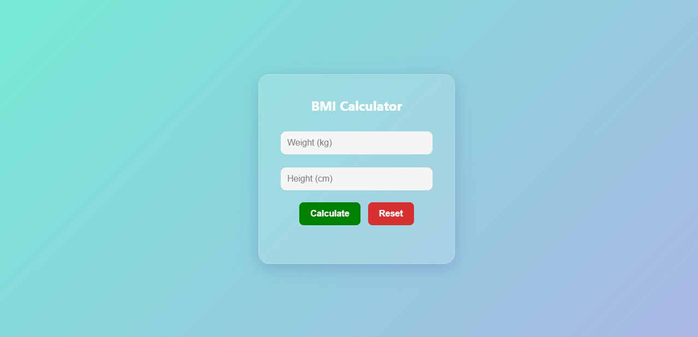

# 🧮 BMI Calculator

A clean, modern BMI (Body Mass Index) Calculator built using **HTML**, **CSS**, and **JavaScript**.

> 📅 Part of my **15 JavaScript Projects** series.  
> 🚀 Focus: Functions & Basic DOM Interactions

---

### 🔍 Features

- Input fields for **weight (kg)** and **height (cm)**
- Calculates BMI using the formula:  
  **BMI = weight / (height in meters)^2**
- Displays your **BMI value** along with the **category**:
  - Underweight
  - Normal
  - Overweight
  - Obese
- Includes a **Reset** button

 
---

### 🧠 Concepts Practiced

- JavaScript Functions
- Input validation
- DOM manipulation
- Event handling (`addEventListener`)
- Conditional logic
- Responsive UI & Glassmorphism design

---

### 📸 Preview

---

### 💡 How to Run

1. Clone this repo or download the ZIP.
2. Open `index.html` in your browser.
3. Enter your weight and height → Click **Calculate**
4. Click **Reset** to clear the form.

---

 

